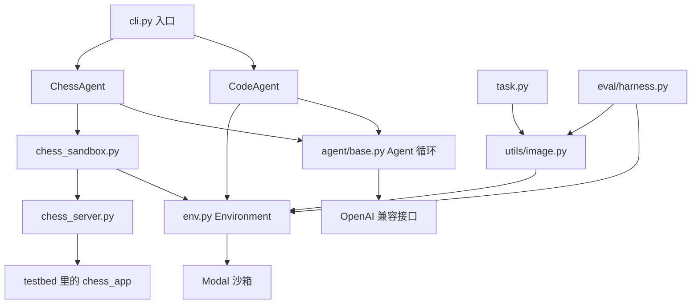

# `src/assignment` 代码结构

这个包实现的是同一套 ReAct 循环上的两个智能体：一个在沙箱里修代码，一个通过 HTTP 下国际象棋。环境、任务、评测都围着这条循环转。

模型不直接碰文件系统或棋盘。`Agent.run()` 反复做三件事：组 prompt、调模型、执行工具。工具的真实效果发生在 Modal 沙箱里。

## 调用关系

两条主路径：

1. **修代码**：`cli.run_code_agent` 读任务，`build_testbed_image` 建镜像，`Environment` 起沙箱。`CodeAgent` 用 `execute` 改代码，用 `send_message` 结束。CLI 从沙箱里读出 `patch.txt`。
2. **下棋**：`cli.run_chess_agent` 把 Part 1 的补丁打进同一套 testbed。`ChessSandbox` 启动棋服务器。`ChessAgent` 用 `play_move` 走白棋，服务器自动回黑棋。

评测不经过智能体。`eval/harness.py` 把候选补丁和测试补丁依次打进沙箱，跑测试，看 fail-to-pass 是否通过。

## 智能体

| 文件 | 作用 |
|---|---|
| `agent/base.py` | 领域无关的循环。读 `.env` 建客户端，维护 `messages`，调用模型，按 token 阈值压缩旧对话，步数超限抛 `StepLimitError`，结束时写轨迹并关掉环境。子类只提供 prompt、工具和 `execute_tool_calls`。 |
| `agent/tools.py` | 给模型看的工具 JSON schema：`execute`、`send_message`、`invoke_skill`、`play_move`、`simulate_move`、`run_python`。这里只描述参数，不执行。 |
| `agent/code_agent.py` | 编程智能体。系统提示里带上沙箱的 `uname` 信息，任务正文来自 issue。`execute` 转到 `env.execute`，`send_message` 把 `finished` 设为真，`invoke_skill` 把技能全文塞回对话。 |
| `agent/chess_agent.py` | 下棋智能体。开局先拉棋盘状态，格式化成 `<chess_state>` 放进任务提示。每步只允许走一步棋；`game_over` 时结束。可选打开模拟和 Python 搜索。 |
| `agent/chess_tools.py` | 棋工具的实现，显式接收 HTTP 客户端，所以同一份代码既能在智能体进程里跑，也能被拷进沙箱。`play_move` 打 `/api/move`，`simulate_move` 打 `/api/simulate`。错误都包成 `<chess_error>`，不让一次非法走法中断整局。 |
| `agent/__init__.py` | 对外导出 `Agent`、`CodeAgent`、`ChessAgent`。 |

`OpenAI(...)` 只决定连哪个兼容网关，参数来自 `OPENAI_API_KEY`、`OPENAI_BASE_URL`、`OPENAI_MAX_RETRIES`。具体模型是 `OPENAI_MODEL`，在 `chat.completions.create(model=self.model)` 里传入。

`base.py` 在每次要新动作之前调用 `maybe_compact_context()`。估计 prompt 超过阈值时，让模型把较早的对话压成 `<working_memory>`。系统提示、任务原文和最近若干步原样保留。

## 环境与任务

| 文件 | 作用 |
|---|---|
| `env.py` | 用 SWE-ReX 在 Modal 上起沙箱。`execute` 跑命令并返回 stdout、stderr、退出码；`stop` 关掉沙箱；`tunnel_url` 取出转发端口的公网地址。`AssignmentModalDeployment` 修正控制端口的 TLS 隧道。 |
| `task.py` | 从任务目录的 `task.json` 读出仓库、基准 commit、Dockerfile、问题陈述。编程任务和下棋任务共用这个对象。 |
| `utils/image.py` | 用本地 `chess_app` 检出和任务 Dockerfile 构建 Modal 镜像。构建前核对 commit，避免工作区里已经修好的代码混进评测环境。 |
| `prompts.py` | 下棋用的系统提示。正常提示要求从 `legal_moves` 里选 UCI 走法；消融提示不提供合法着法列表；`PROGRAMMATIC_CHESS_PROMPT` 告诉模型先用 Python 搜索再走棋。编程智能体的提示写在 `code_agent.py` 里。 |

## 下棋运行时

| 文件 | 作用 |
|---|---|
| `chess_sandbox.py` | `Environment` 的子类。镜像里额外放进服务器和工具脚本，可选打上 Part 1 补丁，在沙箱里拉起棋服务器，并通过加密隧道暴露 `/api/state`、`/api/move`、`/api/reset`。 |
| `chess_server.py` | 在 testbed 里跑的 FastAPI。复用 `chess_app` 的对局接口，并加上无状态的 `/api/simulate`：用 FEN 推演一步，不改当前对局。 |
| `sandbox_python.py` | 沙箱内执行模型写的 Python。把 `simulate_move` 和 `play_move` 注入命名空间，请求打到 `127.0.0.1`。模型代码不会跑在本机智能体进程里。 |

`run_python` 的路径：模型给出代码，`chess_tools._run_python` 在沙箱里调用 `sandbox_python.py`，脚本通过 localhost 调 `chess_server.py`。智能体再拉一次真实棋盘状态，拼进观察。

## 入口、检查与评测

| 文件 | 作用 |
|---|---|
| `cli.py` | 三个命令：`run_code_agent` 修本地棋任务，`run_swebench_agent` 修 SWE-bench 实例，`run_chess_agent` 用补丁启动棋局。三者都接收模型、步数上限、压缩阈值、技能目录和轨迹路径。 |
| `doctor.py` | 开工前检查：任务源码是否对得上 commit、Modal 凭证、`OPENAI_*` 是否可用。加 `--offline` 则不访问推理接口。不启动沙箱。 |
| `eval/instances.py` | 读取 `tasks/swebench/` 里预置的实例：问题描述、测试补丁、已发布镜像、fail-to-pass / pass-to-pass 列表。 |
| `eval/harness.py` | 在沙箱里先打候选补丁，再打测试补丁，跑 pytest 或 Django 测试，解析每条结果。全部规定测试通过才算 `resolved`。 |
| `eval/__init__.py` | 导出评测用的 `evaluate`、`Report`、`Task`。 |

编程侧的技能目录由 CLI 的 `--skills-path` 传进 `Agent.load_skills`，只把名称和描述放进系统提示。模型调用 `invoke_skill` 后才拿到全文。下棋侧用同一套加载逻辑，执行则走 `chess_tools._invoke_skill`。
